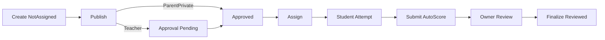

# Quiz System Implementation Plan

## Current state (already working)

Do **not** rebuild from scratch. Core flows exist:

**API:** `[QuizzesController.cs](WebApi/src/RankUpEducation.Api/Controllers/QuizzesController.cs)`, `[QuizQuestionsController.cs](WebApi/src/RankUpEducation.Api/Controllers/QuizQuestionsController.cs)`, services under `[Application/Quizzes](WebApi/src/RankUpEducation.Application/Quizzes/)` + `[QuizQuestionService](WebApi/src/RankUpEducation.Application/QuizQuestions/QuizQuestionService.cs)`.

**React:** manage routes under `[features/quizzes](React/src/features/quizzes/)`, student under `[features/student](React/src/features/student/)`, parent dashboard/history/result, admin `[AdminQuizApprovalsPage](React/src/features/admin/presentation/pages/AdminQuizApprovalsPage.tsx)`.

**Spec:** `[docs/05_RankUp_Quiz_Business_QA.html](docs/05_RankUp_Quiz_Business_QA.html)`.

---

## Wave 1 — Correctness hardening (default first when you say go)

Priority: data integrity and rules that QA marks Partial/Gap and that affect scores/time/status.

### 1.1 Attempt marks snapshot

- Add `Marks` (and optionally `MaxMarks`) to `[QuizAttemptQuestion](WebApi/src/RankUpEducation.Domain/Quizzes/QuizAttemptQuestion.cs)` + EF in `[QuizConfiguration.cs](WebApi/src/RankUpEducation.Infrastructure/Persistence/Configurations/QuizConfiguration.cs)` + schema initializer SQL.
- On start in `[QuizService](WebApi/src/RankUpEducation.Application/Quizzes/QuizService.cs)`, copy from `QuizQuestion.Marks`.
- Score/review paths must use snapshot marks, not live `QuizQuestion.Marks`.

### 1.2 Time management (server + status)

- Enforce `TimeLimitMinutes` on submit (and ideally draft): reject if elapsed since `StartedDate` exceeds budget (with small grace).
- When UI/timer expiry path submits, write **AutoSubmitted (83)** instead of only Submitted (82); keep Submitted for manual submit.
- Explicit draft flush before auto-submit in `[StudentQuizAttemptPage.tsx](React/src/features/student/presentation/pages/StudentQuizAttemptPage.tsx)`.
- Also call assignment window check on submit (today start/draft check window; submit may skip).

### 1.3 QuizResultStatus progression

- On attempt start → In Progress (23); on submit → Under Review (22) or Completed (21); on finalize → Completed; on window end with no attempt → Expired (20).
- Update in `[QuizAssignService](WebApi/src/RankUpEducation.Application/Quizzes/QuizAssignService.cs)` / attempt/review services; keep `[QuizStatusCalculator](WebApi/src/RankUpEducation.Application/Quizzes/QuizStatusCalculator.cs)` as fallback for display.

### 1.4 Authoring / assign UI completeness

- Add **Quiz type** (`quizTypeId`) to `[QuizForm.tsx](React/src/features/quizzes/presentation/components/QuizForm.tsx)` / create payload (API already accepts it).
- Expose assign modes `**one**` and `**allLinked**` in `[AssignQuizDialog.tsx](React/src/features/quizzes/presentation/components/AssignQuizDialog.tsx)` (API already supports them).
- Optional: auto-suggest `TimeLimitMinutes` from sum of question `EstimatedTimeSeconds` when questions change (UI helper; owner can override).

### 1.5 Small API consistency

- Align approve endpoint controller `[Authorize(Roles=...)]` with reject (today approve is service-only).
- Persist reject reason if still only returned in response.

**Exit criteria:** QA scenarios QZ-18/19 pass with server time checks; historical mark edits don’t change old attempts; assignment result status advances; create/assign UI matches API modes.

---

## Wave 2 — Student attempt UX

| Item                                    | API                                                   | React                                                                                                                    |
| --------------------------------------- | ----------------------------------------------------- | ------------------------------------------------------------------------------------------------------------------------ |
| Navigation modes Free/Sequential/Locked | Add quiz setting + enforce on attempt payload         | Respect in `[StudentQuizAttemptPage](React/src/features/student/presentation/pages/StudentQuizAttemptPage.tsx)`          |
| Mark-for-review                         | Persist on attempt-question (local UI already exists) | Send on draft/submit                                                                                                     |
| Autosave                                | Already has draft endpoint                            | Add `visibilitychange` / `beforeunload` flush                                                                            |
| Low-time warning                        | —                                                     | Modal/toast before ≤60s styling                                                                                          |
| Student list filters                    | list already role-scoped                              | Type/status/date filters on `[StudentQuizzesPage](React/src/features/student/presentation/pages/StudentQuizzesPage.tsx)` |
| Per-question timer                      | Optional later                                        | Only if product still wants it after Wave 1                                                                              |

---

## Wave 3 — Audiences

Today: `one`, `selected`, `group`, `allInGrade`, `allLinked`.

1. **Section** assign (students already have `section`) — new mode in `[QuizAssignService](WebApi/src/RankUpEducation.Application/Quizzes/QuizAssignService.cs)` + Assign dialog.
2. **School** (all campuses) — elevated role.
3. **Multiple schools / Public** — PortalAdmin + visibility model change (students today require assignment row).

Keep ParentPrivate scoped to linked children only.

---

## Wave 4 — Type rules and AI

- Enforce Practice / Assessment / Competition / Surprise behavioral defaults (attempts, time, show-answers-after-submit) in manage + attempt services.
- Replace AI review stub in `[QuizService](WebApi/src/RankUpEducation.Application/Quizzes/QuizService.cs)` with real provider or keep stub explicitly out of scope.
- Anti-cheat / Competition-only controls only after Waves 1–2 are stable.

---

## Recommended execution order when you command

1. Wave 1 only (backend + React together, small PRs per subsection 1.1 → 1.5).
2. Then Wave 2.
3. Wave 3/4 only after you pick which audiences/types matter next.

## Out of scope unless requested

- Full content freeze of question text/options on attempt (beyond marks/order snapshot).
- Mobile Flutter parity (Web first unless you say otherwise).
- Rewriting existing lifecycle/approval clean model (keep Pending/Approved/Rejected + NotAssigned→Archived).

## Wait for your command

No code changes until you say which wave (or subsection) to implement first. Default recommendation: **Wave 1.1 marks snapshot + Wave 1.2 time enforcement** as the first PR pair.